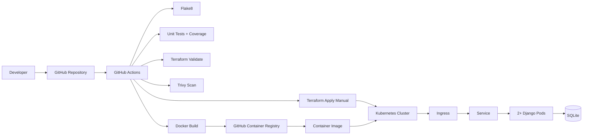

# Devsu Demo DevOps - Python

Entrega para la prueba tecnica DevOps de Devsu.

Aplicacion base: `demo-devops-python`  
Repositorio: `https://github.com/walterfontoura82/devsu-demo-devops_python`  
Stack: Python, Django REST Framework, Docker, GitHub Actions, Kubernetes y Terraform.

## Objetivo

Este proyecto dockeriza una API Django, valida el codigo mediante CI, publica la imagen en GitHub Container Registry y define el despliegue Kubernetes con manifiestos YAML y Terraform.

La entrega incluye:

- Dockerfile productivo con usuario no root, Gunicorn y healthcheck.
- Pipeline CI/CD con build, tests, coverage, analisis estatico, validacion Terraform, escaneo de vulnerabilidades y publicacion de imagen.
- Manifiestos Kubernetes para despliegue local.
- Terraform para administrar los recursos Kubernetes.
- Deployment con dos replicas, requests/limits, probes e HPA.
- Documentacion de ejecucion local, Docker, Kubernetes, Terraform y Git.

## Arquitectura



## Flujo Git Recomendado

El repositorio nuevo arranca limpio desde `main`. Para evitar problemas de ramas como `Folders` o carpetas confundidas con ramas:

```bash
git checkout main
git add .
git commit -m "Initial DevOps delivery"
git push -u origin main
```

Para cambios posteriores:

```bash
git checkout main
git pull --ff-only origin main
git checkout -b feature/descripcion-corta
# realizar cambios
git add .
git commit -m "Describe the change"
git push -u origin feature/descripcion-corta
```

Luego abrir Pull Request hacia `main`. El pipeline se ejecuta en `pull_request` y en `push` a `main`.

## Variables de Entorno

| Variable | Descripcion | Ejemplo |
|---|---|---|
| `DJANGO_SECRET_KEY` | Secret key usada por Django | `local-secret` |
| `DJANGO_DEBUG` | Habilita modo debug | `False` |
| `DJANGO_ALLOWED_HOSTS` | Hosts permitidos separados por coma | `localhost,127.0.0.1` |
| `DATABASE_NAME` | Nombre del archivo SQLite | `db.sqlite3` |

Ejemplo:

```bash
export DJANGO_SECRET_KEY=local-secret
export DJANGO_DEBUG=False
export DJANGO_ALLOWED_HOSTS=localhost,127.0.0.1
export DATABASE_NAME=db.sqlite3
```

Tambien se incluye `.env.example`.

## Ejecucion Local

```bash
python -m venv .venv
source .venv/bin/activate
pip install -r requirements.txt
python manage.py migrate
python manage.py runserver
```

Endpoint:

```text
http://localhost:8000/api/
```

## Tests y Coverage

```bash
python manage.py test
coverage run manage.py test
coverage report
```

## Docker

Construir la imagen:

```bash
docker build -t devsu-demo-devops-python:latest .
```

Ejecutar el contenedor:

```bash
docker run --rm \
  -p 8000:8000 \
  -e DJANGO_SECRET_KEY=local-secret \
  -e DJANGO_DEBUG=False \
  -e DJANGO_ALLOWED_HOSTS=localhost,127.0.0.1 \
  -e DATABASE_NAME=db.sqlite3 \
  devsu-demo-devops-python:latest
```

Validar:

```bash
curl http://localhost:8000/api/
```

## CI/CD

Workflow:

```text
.github/workflows/ci-cd.yml
```

Etapas:

1. Checkout.
2. Instalacion de Python y dependencias.
3. Analisis estatico con Flake8.
4. Tests unitarios con coverage.
5. Artefacto `coverage.xml`.
6. `terraform fmt` y `terraform validate`.
7. Escaneo de vulnerabilidades con Trivy.
8. Build de imagen Docker.
9. Push a GitHub Container Registry en eventos que no sean Pull Request.
10. Despliegue manual a Kubernetes con Terraform mediante `workflow_dispatch`.

URL del pipeline:

```text
https://github.com/walterfontoura82/devsu-demo-devops_python/actions
```

Imagen esperada:

```text
ghcr.io/walterfontoura82/devsu-demo-devops_python:latest
```

Secrets requeridos para despliegue desde GitHub Actions:

| Secret | Uso |
|---|---|
| `KUBE_CONFIG_B64` | Kubeconfig codificado en base64 |
| `DJANGO_SECRET_KEY` | Secret key productiva para Django |

El despliegue automatico queda como ejecucion manual para evitar modificar un cluster por cada push.

## Kubernetes

Manifiestos:

```text
k8s/
├── namespace.yaml
└── app/
    ├── deployment.yaml
    ├── hpa.yaml
    ├── ingress.yaml
    ├── secret.yaml
    └── service.yaml
```

Aplicar con `kubectl`:

```bash
kubectl apply -f k8s/namespace.yaml
kubectl apply -f k8s/app/
kubectl rollout status deployment/django-app -n devsu-demo
```

Validar recursos:

```bash
kubectl get all -n devsu-demo
kubectl get hpa -n devsu-demo
kubectl get ingress -n devsu-demo
```

Para probar Ingress local con Minikube:

```bash
minikube addons enable ingress
echo "$(minikube ip) devsu-demo.local" | sudo tee -a /etc/hosts
curl http://devsu-demo.local/api/
```

## Terraform

Terraform administra los mismos recursos Kubernetes de forma declarativa desde:

```text
terraform/
├── main.tf
├── outputs.tf
├── terraform.tfvars.example
├── variables.tf
└── versions.tf
```

Uso local:

```bash
cp terraform/terraform.tfvars.example terraform/terraform.tfvars
terraform -chdir=terraform init
terraform -chdir=terraform fmt -recursive
terraform -chdir=terraform validate
terraform -chdir=terraform plan
terraform -chdir=terraform apply
```

Ejemplo con imagen especifica:

```bash
terraform -chdir=terraform apply \
  -var="image_repository=ghcr.io/walterfontoura82/devsu-demo-devops_python" \
  -var="image_tag=latest"
```

Salida esperada:

```text
namespace = "devsu-demo"
application_image = "ghcr.io/walterfontoura82/devsu-demo-devops_python:latest"
ingress_host = "devsu-demo.local"
```

## Consideraciones de Produccion

- Reemplazar SQLite por PostgreSQL o un servicio administrado.
- Usar secretos externos, por ejemplo External Secrets Operator, Vault o secretos del proveedor cloud.
- Configurar TLS en Ingress con cert-manager.
- Publicar DNS real para el endpoint.
- Configurar observabilidad: logs centralizados, metricas, alertas y tracing.
- Usar backend remoto para Terraform state si se administra infraestructura compartida.
- Definir politicas de despliegue progresivo, rollback y versionado de imagenes por SHA.
- Mantener GHCR publico o configurar `imagePullSecret` si la imagen queda privada.

## Pendientes o Limitaciones

El despliegue publico del endpoint depende de contar con un cluster accesible desde internet y DNS/TLS. Para una entrega local, se documenta el acceso por Minikube o Docker Desktop y se provee el pipeline publico de GitHub Actions como evidencia de ejecucion.
